# Praktikum Gestuters
# Yesi Agustin 4522210023

> 1. Membuat Project Fluter
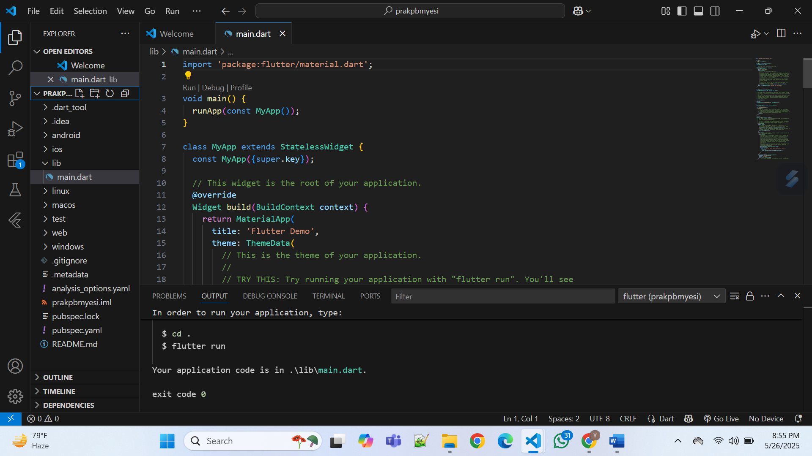

> 2. Buka Code Editor 
- 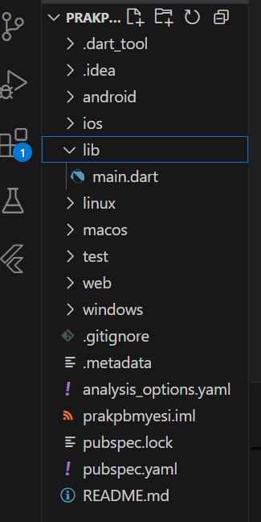

> 3. Menambahkan pada lib
- 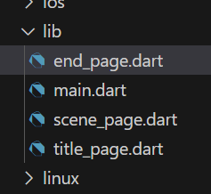

> 4. Mengisi Main.dart
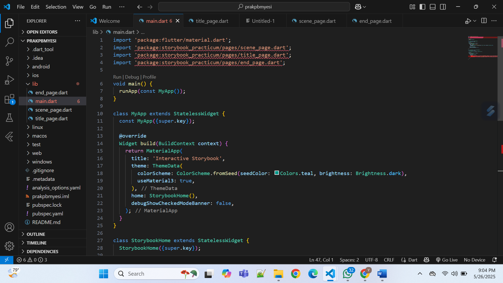

> 5. Mengisi title_page.dart
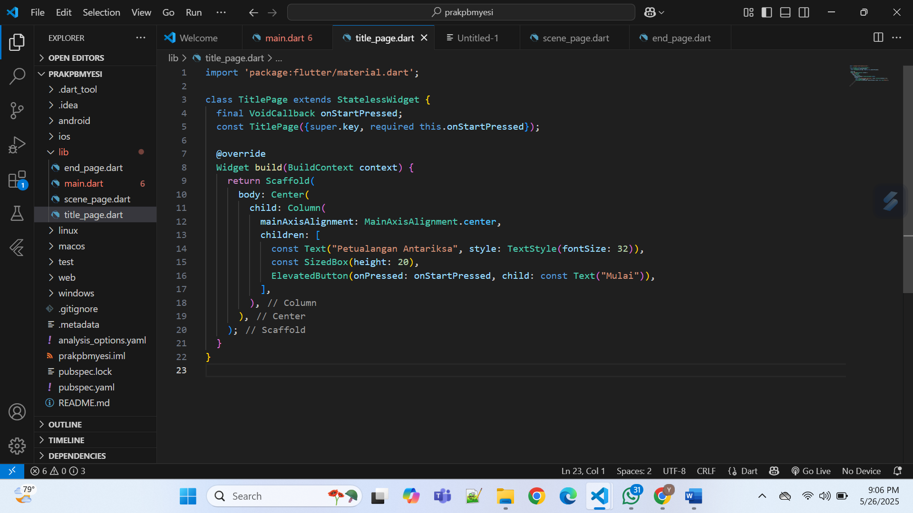

> 6. Mengisi end_page.dart
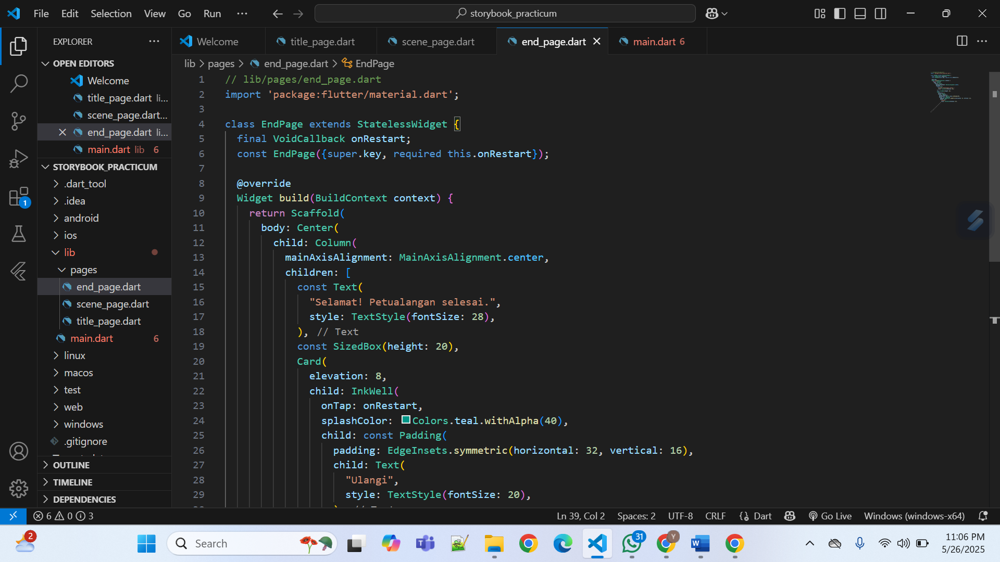

> 7.  pada lib/pages/scene_page.dart → ganti isinya dengan kerangka StatefulWidget
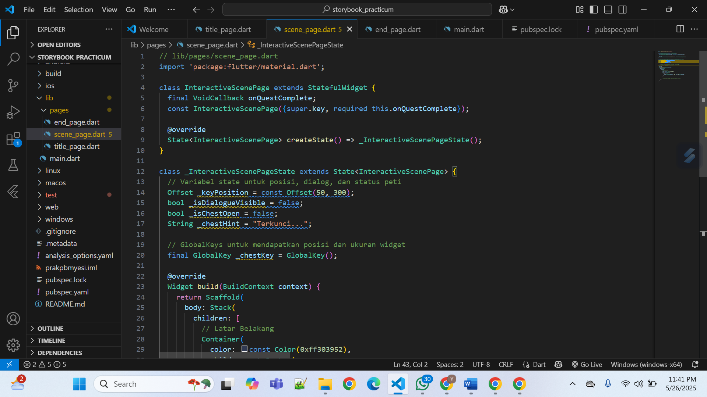

> 8. Menambahkan Astronaut & Balon Dialog (Double Tap). Di dalam Stack, tambahkan Positioned untuk astronaut
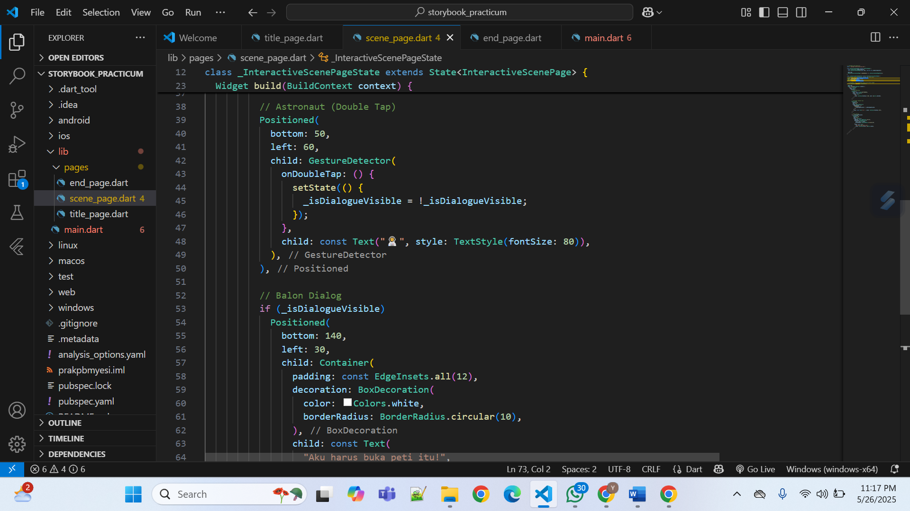

> 9. Menambahkan  Peti & Petunjuk (Long Press). Di dalam Stack, tambahkan Positioned untuk peti.
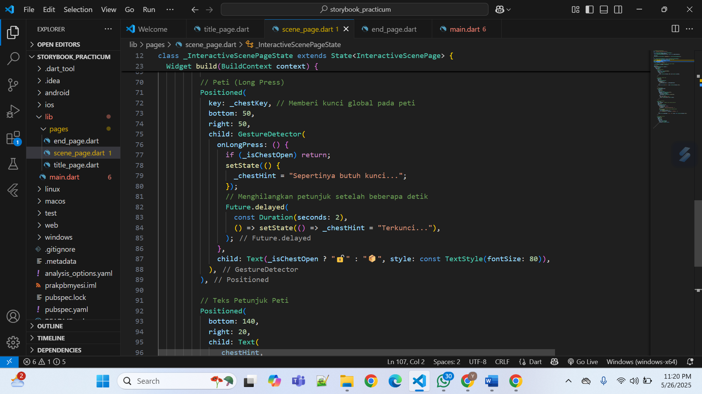

> 10. Menambahkan Kunci & Logika Drag-and-Drop. Di dalam Stack, tambahkan Positioned untuk kunci.
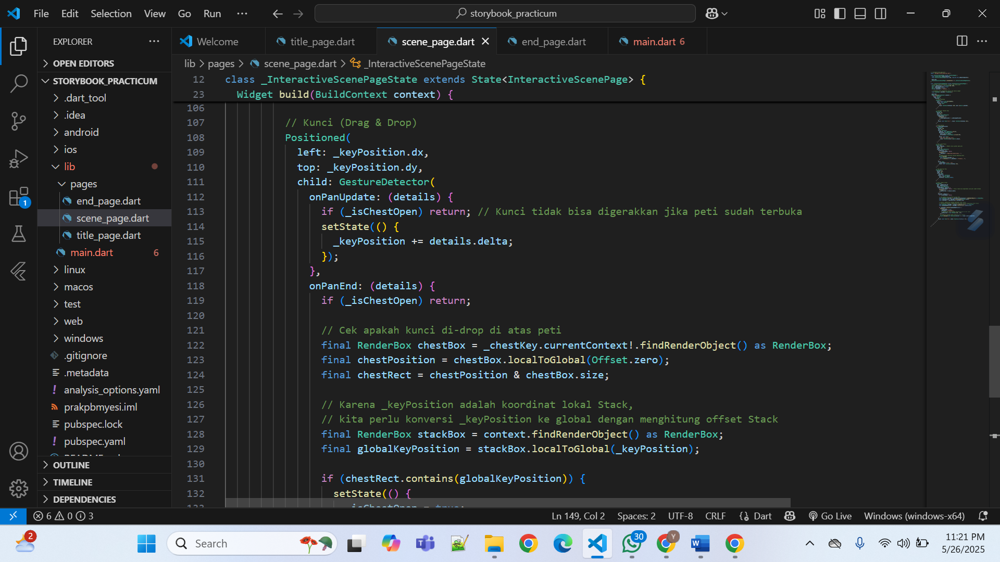

> 11. Uji coba
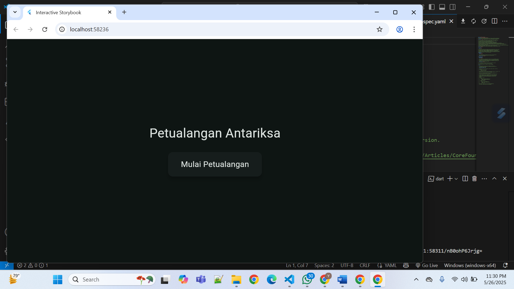

> 12 & 13. Efek Visual (InkWell) , Bungkus ElevatedButton dengan Card dan InkWell untuk efek yang lebih bagus. Ganti ElevatedButton dengan kode baru.
 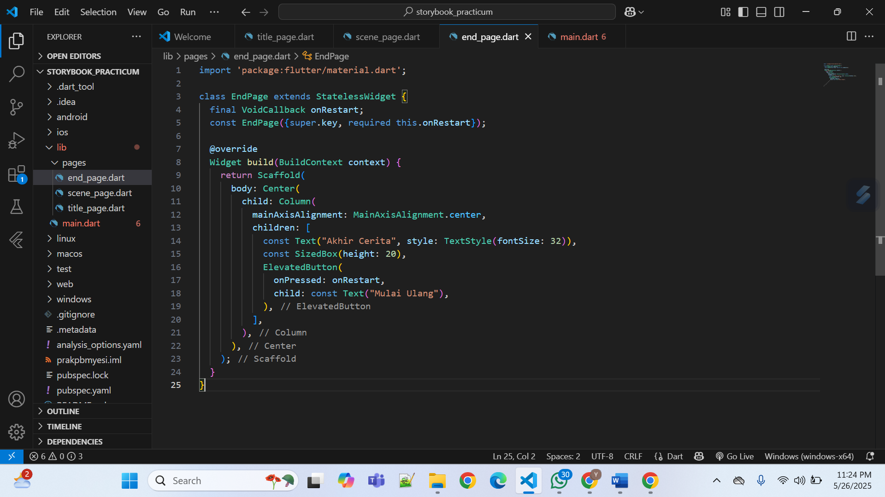

> 14, 15 & 16. modifikasi Container latar belakang
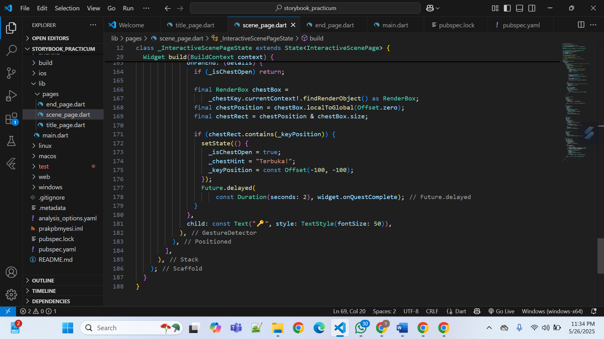

> 17. Bungkus Container latar belakang dengan RawGestureDetector dan Transform. 
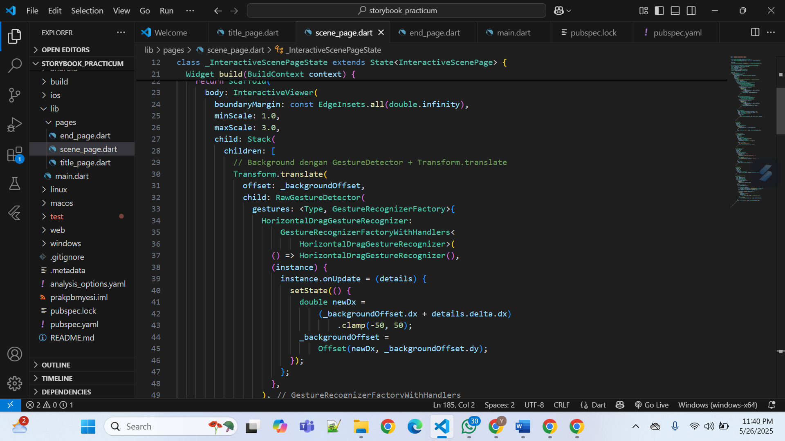

> 18, 19 & 20. Ujicoba: Coba geser latar belakang
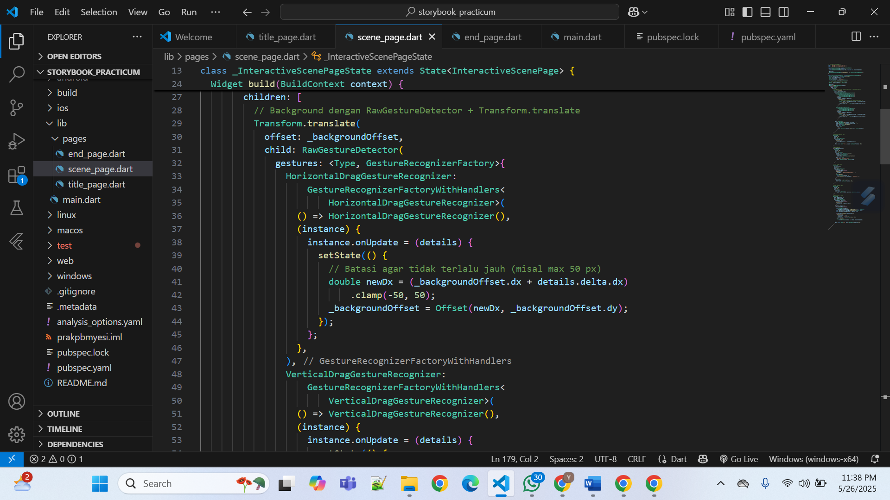

> 21. Hasil
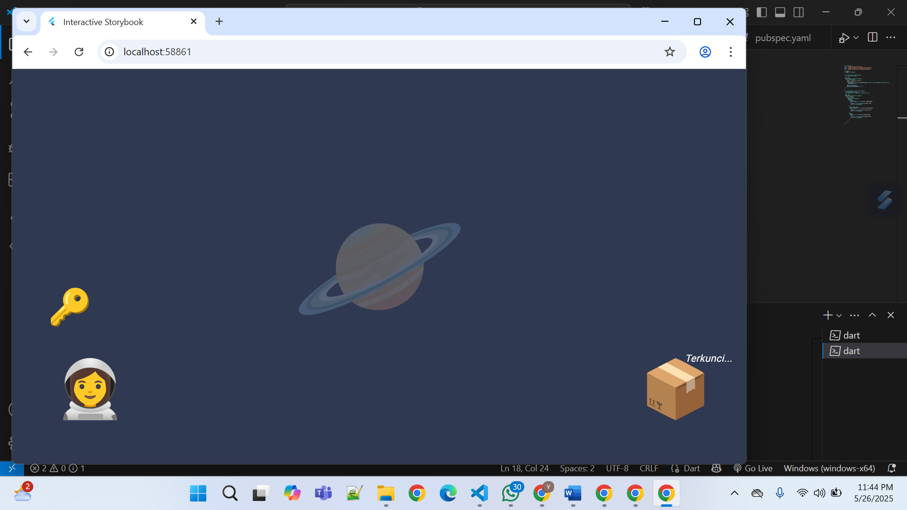
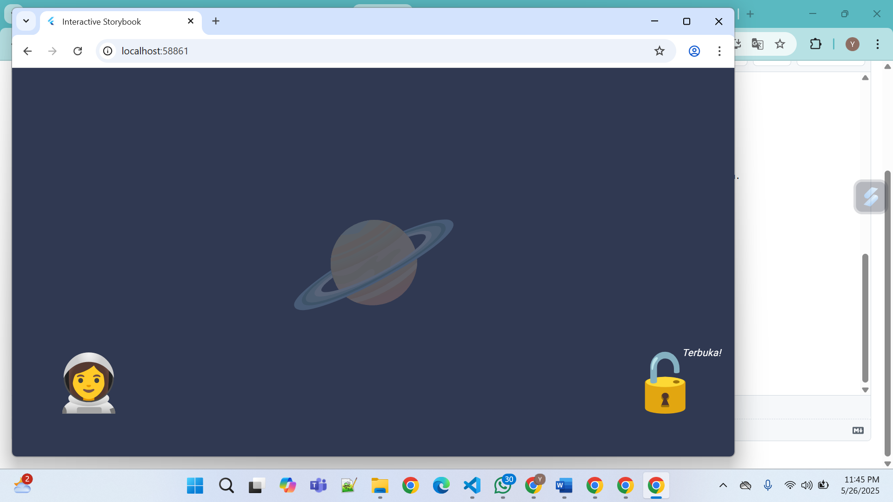
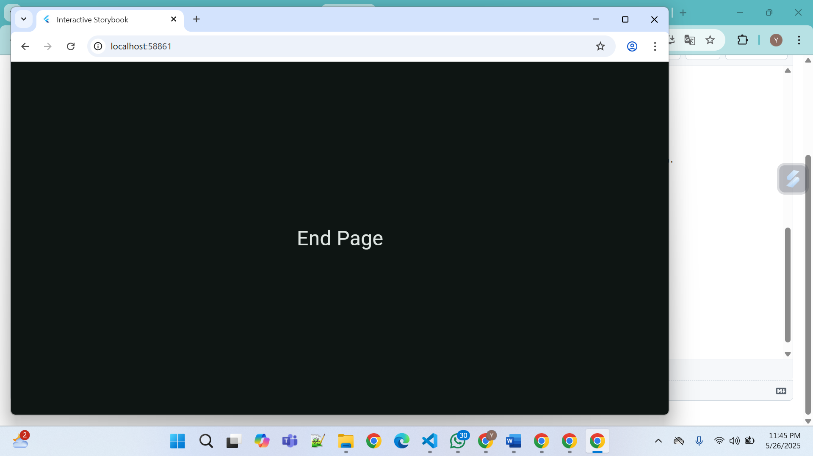

